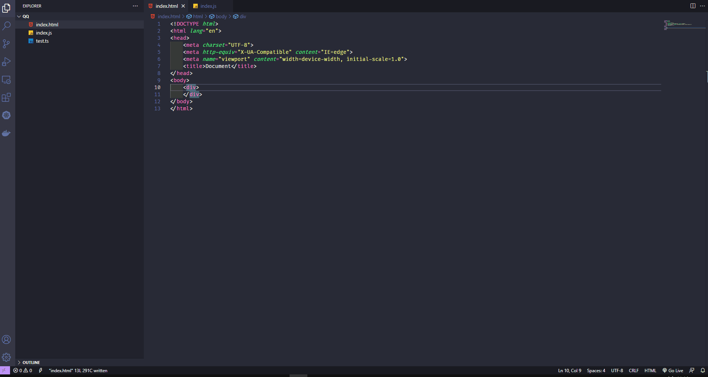

# 功能

一切都是 `假的` ,  產生台灣常用的假資料



# 使用方式
目前支援命令如下:

`fcname` 產生中文名字

`fename` 產生老外名字

`fphone` 產生手機號碼

`ftwid` 產生身分證字號

`ftwpoint` 產生隨機台灣範圍的經緯度格式 lon lat

# 編譯
[看這篇文章](https://itnext.io/creating-and-publishing-vs-code-extensions-912b5b8b529)
```
vsce package
```